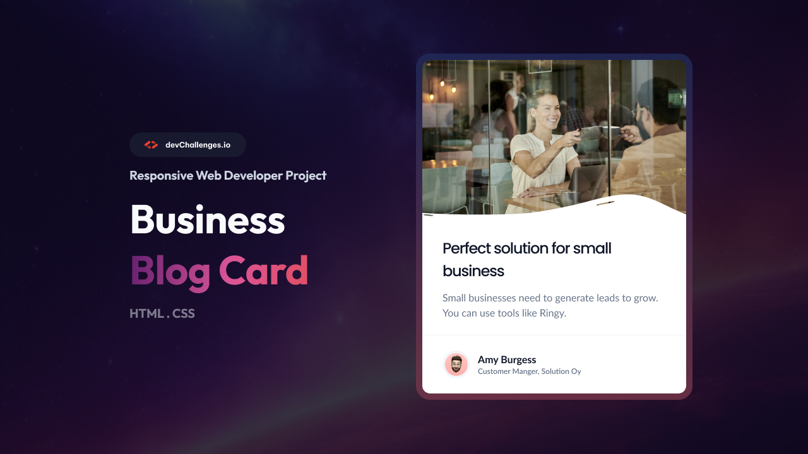

# Business Blog Card | devChallenges

## Overview

A responsive business blog card component created for the devChallenges "Business Blog Card" challenge. This clean, modern card features:

- Hero image with decorative overlay
- Business solution title and description
- Author section with avatar and credentials

### What I learned

- Using SVG overlays on images for visual effects
- Creating responsive card layouts with CSS
- Proper semantic HTML structure for content cards
- Flexbox for author information layout

## Built With

- Semantic HTML5
- CSS custom properties
- Flexbox
- Responsive design principles

## Features

This project fulfills the following requirements:

- Responsive card layout that works on all screen sizes
- Properly structured HTML with semantic elements
- Clean, modern design with visual hierarchy
- Image with decorative overlay effect
- Author section with avatar and information

  <h3>
    <a href="https://krowey-richmond.github.io/devChallenges/business-blog-card">
      Demo
    </a>
  </h3>

