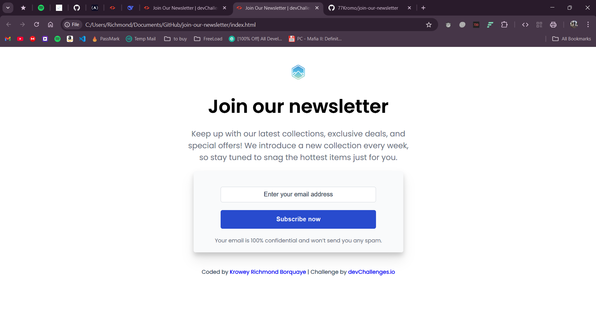

# Newsletter Signup | devChallenges

<p align="center">
  <a href="https://newsletter-join.netlify.app/">Live Demo</a> &#124; 
  <a href="https://devchallenges.io/challenge/join-our-newsletter">Challenge</a>
</p>



Responsive newsletter subscription form with smooth transitions and mobile optimization.

## Features
- Mobile-first responsive design
- Email validation
- Hover/focus states
- Clean shadow effects

## Built With
- HTML5
- CSS3 (Flexbox)
- Google Fonts (Poppins)

## Key Code
```css

@media (max-width: 480px) {
  .main { width: 300px }
  h1 { font-size: 1.25rem }
}
```

## Usage
1. Clone repo
2. Open index.html
3. Test form responsiveness

## Author

- GitHub: [77Kromo](https://github.com/77Kromo)
- X : [Kromo77](https://x.com/kromo772004)
- LinkedIn: Krowey Richmond Borquaye