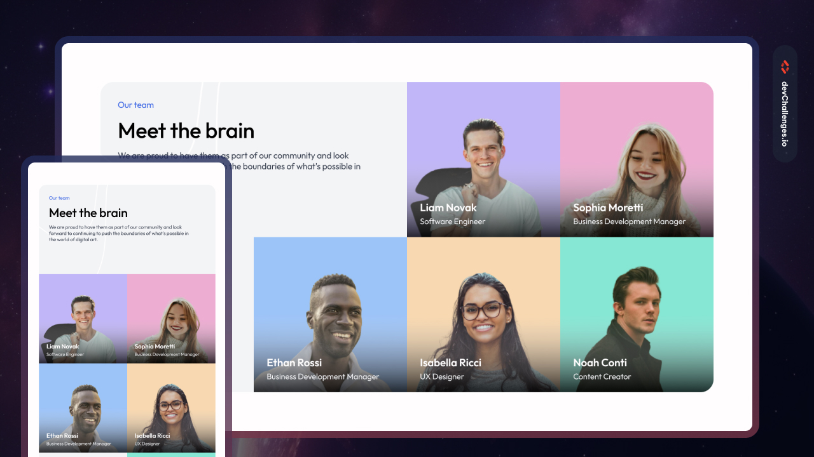

# Meet the Team Section | devChallenges

<div align="center">
  <a href="https://krowey-richmond.github.io/devChallenges/our-team-layout/" target="_blank">
    
  </a>

[](https://krowey-richmond.github.io/devChallenges/our-team-layout/)
[](https://github.com/krowey-richmond/our-team-layout)

</div>

## 📖 Overview

A responsive "Meet the Team" section built with semantic HTML and modern CSS techniques.

Built as a solution to the  
[Meet the Team Section Challenge](https://devchallenges.io/challenge/meet-the-team-section-challenge) by devChallenges.io.

## ✨ Features

- Semantic HTML5 markup
- CSS Grid and Flexbox layout
- Mobile-first responsive design
- Smooth hover animations and transitions
- Typography using Google Fonts (Outfit)

## 🧰 Tech Stack

- HTML5
- CSS3 (Grid, Flexbox, Transitions)
- Responsive design techniques
- Media queries
- Google Fonts
- SVG icons

## 📚 What I Learned

- Advanced Grid layout with `auto-fill` and `minmax()`
- Responsive design using `clamp()` and viewport units
- Performance tips like using `@2x` images for clarity

## 📁 Project Structure

```
/
├── index.html
├── styles.css
├── resources/
│   ├── person\_1.png
│   ├── Gradient.svg
│   └── arrow-up.svg
└── README.md
```

## 🚀 Getting Started

```bash
git clone https://github.com/krowey-richmond/our-team-layout.git
cd meet-the-team
open index.html
```

## 👨‍💻 Author

**Krowey Richmond Borquaye**

- [GitHub](https://github.com/krowey-richmond/our-team-layout)
- [LinkedIn](https://www.linkedin.com/in/krowey-richmond)
- [Twitter](https://x.com/kromo772004)
