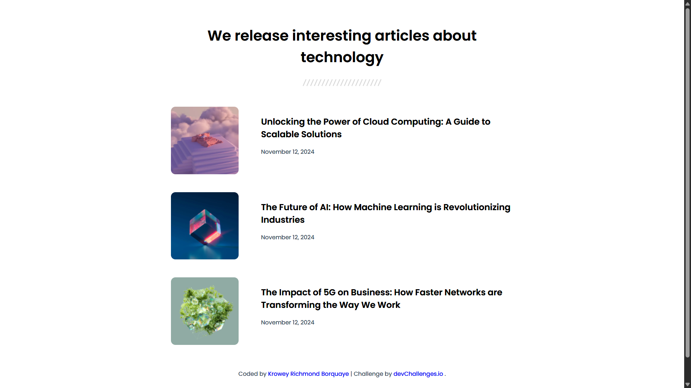

# Simple Article Listing | devChallenges

<div align="center">
  Solution for the <a href="https://devchallenges.io/challenge/simple-article-listing" target="_blank">Simple Article Listing</a> challenge from <a href="http://devchallenges.io" target="_blank">devChallenges.io</a>.
</div>

<div align="center">
  <h3>
    <a href="https://simple-article-list.netlify.app/">
      Live Demo
    </a>
    <span> | </span>
    <a href="https://devchallenges.io/solution/51964">
      Solution
    </a>
    <span> | </span>
    <a href="https://devchallenges.io/challenge/simple-article-listing">
      Challenge
    </a>
  </h3>
</div>

## Overview
[](https://simple-article-list.netlify.app/)

A responsive article listing page featuring technology topics with clean typography and adaptive layout.

## Features

- **Responsive Design**: Adapts seamlessly from mobile to desktop
- **Semantic HTML**: Proper use of `<article>` and `<main>` elements
- **Flexible Layout**: Article cards transform from stacked to side-by-side
- **Performance Optimized**: Efficient CSS with media queries
- **Accessible**: Proper contrast and semantic structure

## Built With

- Semantic HTML5
- CSS3 (Flexbox)
- Mobile-first workflow
- Google Fonts (Poppins)
- Responsive Images

## What I Learned

### CSS Techniques
```css
/* Responsive article layout */
article {
  display: flex;
  flex-direction: column; /* Mobile: stacked */
}

@media (min-width: 640px) {
  article {
    flex-direction: row; /* Desktop: side-by-side */
    gap: 50px;
  }
}
```

### HTML Structure
```html
<!-- Semantic article markup -->
<article>
  
  <div>
    <h2>Unlocking the Power of Cloud Computing</h2>
    <p class="date">November 12, 2024</p>
  </div>
</article>
```

### Key Takeaways
1. Implemented responsive design with mobile-first approach
2. Used semantic HTML for better accessibility
3. Created fluid typography that scales with viewport
4. Optimized image display with object-fit
5. Developed progressive enhancement strategy

## Project Structure

```
simple-article-listing/
├── index.html
├── style.css
├── README.md
└── resources/
    ├── photo_1.png
    ├── photo_2.png
    ├── photo_3.png
    ├── Seperator.svg
    └── favicon.ico
```

## How to Use

1. Clone the repository:
   ```bash
   git clone https://github.com/77Kromo/simple-article-listing.git
   ```
2. Open `index.html` in your browser
3. Resize browser to see responsive behavior

## Author

- GitHub: [@77Kromo](https://github.com/77Kromo)
- Frontend Mentor: [@77Kromo](https://www.frontendmentor.io/profile/77Kromo)
- Twitter: [@kromo772004](https://x.com/kromo772004)
- LinkedIn: [Richmond](https://www.linkedin.com/in/krowey-richmond-borquaye77/)
- DevChallenges: [@77Kromo](https://devchallenges.io/portfolio/77Kromo)

## Acknowledgments

- [devChallenges](https://devchallenges.io) for the design inspiration
- [Google Fonts](https://fonts.google.com) for the Poppins typeface
- [HTML & CSS for absolute beginners by Kevin Powell](https://learn.kevinpowell.co/course/html-css-for-absolute-beginners) for responsive design techniques

