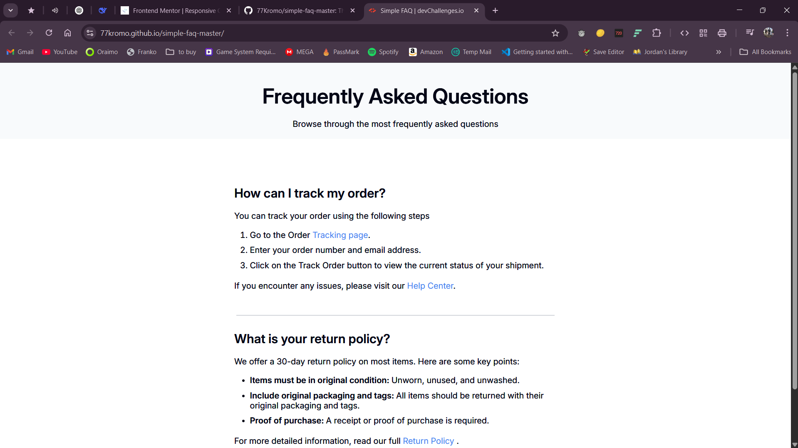

# Simple FAQ Page


## Overview


## Project Description

This is a simple, responsive Frequently Asked Questions (FAQ) webpage built using HTML and CSS. It was developed as part of a challenge on [devChallenges.io](https://www.devchallenges.io). The page displays common questions and answers related to order tracking and return policies.
## Features

* Clean and modern design
* Responsive layout for mobile, tablet, and desktop
* Semantic HTML structure
* External stylesheet with media queries
* Easy to read and navigate


## Folder Structure

```
.
├── index.html
├── styles.css
└── resources/
    └── favicon.ico
```


## Technologies Used

* **HTML5** — for markup
* **CSS3** — for styling
* **Google Fonts** — Inter font family
* **Responsive Design** — using media queries

## How to Use

1. Clone or download the repository.
2. Open `index.html` in your browser.
3. Explore the FAQ content and styling.


## Author

**Krowey Richmond Borquaye**

* Project completed for devChallenges.io
* Coded by Richmond Borquaye


## Live Preview

*[Click Here](https://77kromo.github.io/simple-faq-master/)*


