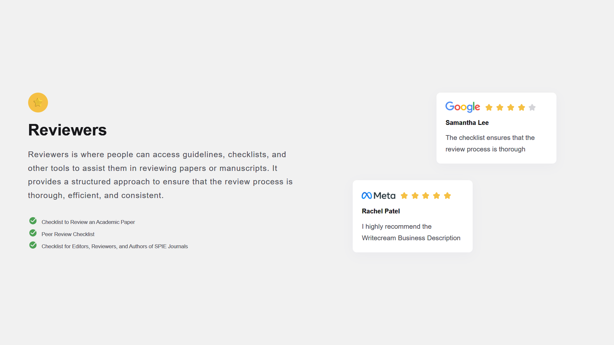

# Testimonial Page | devChallenges

   Solution for a challenge <a href="https://devchallenges.io/challenge/testimonial-page" target="_blank">Testimonial Page</a> from <a href="http://devchallenges.io" target="_blank">devChallenges.io</a>.

  <h3>
    <a href="https://testimonial-page-master.netlify.app/">
      Demo
    </a>
     | 
    <a href="https://devchallenges.io/solution/52328">
      Solution
    </a>
     | 
    <a href="https://devchallenges.io/challenge/testimonial-page">
      Challenge
    </a>
  </h3>

## Table of Contents

- [Overview](#overview)
  - [What I learned](#what-i-learned)
  - [Useful resources](#useful-resources)
- [Built with](#built-with)
- [Features](#features)
- [Contact](#contact)

## Overview

This testimonial page was created as a solution to the devChallenges.io Testimonial Page challenge. The page features a responsive layout that displays reviewer information, star ratings, and testimonials from different companies.

### What I learned

- Implemented responsive design with CSS Grid and Flexbox
- Used CSS `clamp()` for fluid typography
- Created a star rating system with SVG icons
- Applied modern CSS techniques like custom properties and transitions
- Developed a mobile-first approach with media queries for different screen sizes

### Useful resources

- [CSS Tricks](https://css-tricks.com/) - Great resource for modern CSS techniques
- [MDN Web Docs](https://developer.mozilla.org/) - Comprehensive documentation for HTML and CSS
- [devChallenges.io](https://devchallenges.io/) - For design inspiration and challenges

## Built with

- Semantic HTML5 markup
- CSS custom properties
- Flexbox
- Mobile-first workflow
- Responsive design principles

## Features

- Responsive layout that works on mobile, tablet, and desktop
- Star rating system with partial stars
- Clean, modern design with subtle animations
- Semantic HTML structure
- Accessibility considerations

## Contact

- GitHub [@77Kromo](https://github.com/77Kromo)
- Twitter [@kromo772004](https://x.com/kromo772004)